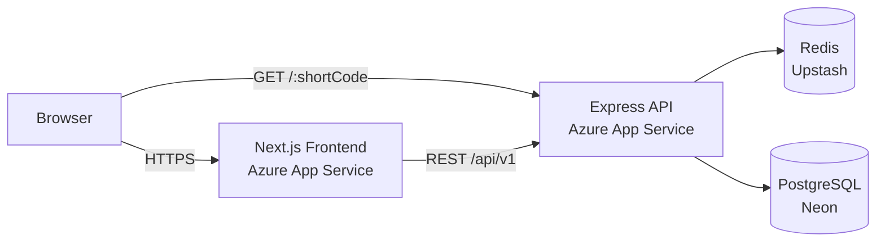
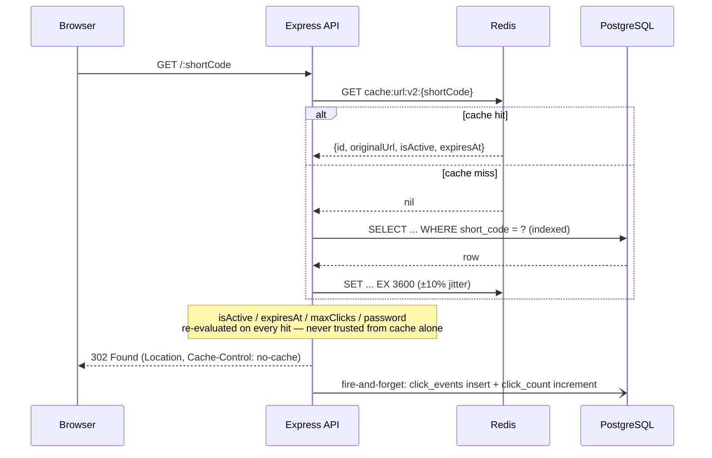
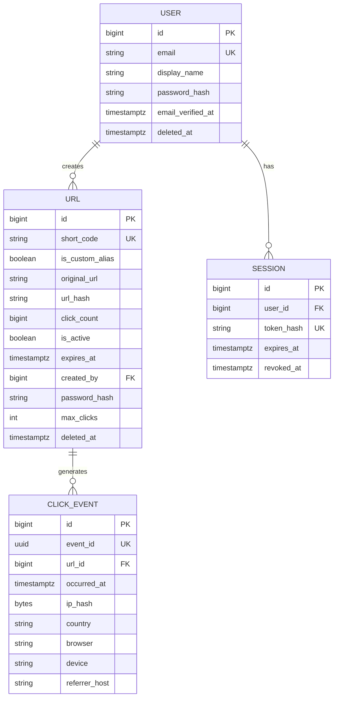
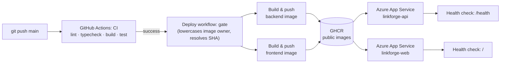

# LinkForge

Most URL shortener tutorials stop at "insert a row, redirect on lookup."
LinkForge starts there and keeps going — it's a fully deployed, production-shaped
service built to explore what a shortener looks like once real traffic,
real failure modes, and real users enter the picture: authenticated
multi-tenant links, a Redis cache designed to survive an outage instead of
causing one, privacy-conscious analytics, and a deployment pipeline that
ships itself from GitHub to Azure with no stored cloud credentials.

[](https://github.com/nocapgaurav/linkforge/actions/workflows/ci.yml)


**Live demo** — Frontend: [linkforge-web.azurewebsites.net](https://linkforge-web.azurewebsites.net) · Backend API: [linkforge-api.azurewebsites.net/api/v1](https://linkforge-api.azurewebsites.net/api/v1)



### Highlights

- 🚀 **Deployed** to Azure App Service through a fully automated GitHub Actions pipeline
- 🔐 **OIDC-authenticated CI/CD** to GHCR and Azure — zero stored cloud secrets
- ⚡ **Redis cache-aside** for redirects, fail-open by design rather than by accident
- ✅ **252 automated tests** (unit + integration) run against real Postgres and Redis, not mocks
- 🔑 **JWT auth** with rotating, theft-detected refresh tokens
- 📊 **Privacy-conscious analytics** — hashed, daily-rotating IPs, no raw PII stored
- 🐳 **Multi-stage, non-root Docker builds** with real health checks in every environment

---

## Table of Contents

- [Problem Statement](#problem-statement)
- [Features](#features)
- [System Architecture](#system-architecture)
- [Project Structure](#project-structure)
- [API Overview](#api-overview)
- [Database Design](#database-design)
- [Caching Strategy](#caching-strategy)
- [Authentication](#authentication)
- [Security](#security)
- [Deployment](#deployment)
- [CI/CD](#cicd)
- [Local Development](#local-development)
- [Environment Variables](#environment-variables)
- [Performance](#performance)
- [Why These Technologies?](#why-these-technologies)
- [Challenges Faced](#challenges-faced)
- [Future Improvements](#future-improvements)
- [What This Project Demonstrates](#what-this-project-demonstrates)
- [License](#license)

---

## Problem Statement

Inserting a row and redirecting on lookup is the easy 10% of a URL
shortener. The interesting 90% starts once the redirect has to stay fast
under read-heavy, bursty traffic the write path never sees — once a link
can die by time, by click count, or by manual deactivation, all
independently — once analytics has to run without ever slowing down or
risking that redirect — and once abuse controls have to degrade gracefully
instead of taking the product down when their own dependency fails.

LinkForge focuses on exactly those problems: a Redis cache that stays
consistent without a coordination protocol, short codes that resist both
collision and enumeration, and infrastructure that fails open rather than
closed.

The dashboard, auth system, and analytics all exist in service of getting
that core right.

---

## Features

### Core

- Short link creation with an optional custom alias, or a generated
  7-character base62 code
- `302` redirect (never `301`) at the domain root — keeps click counting,
  expiry, and deactivation enforceable
- Cursor-paginated, keyset-based link listing
- Link editing — destination, expiry, click limit, password, and active
  state, independently
- Soft delete — codes are tombstoned and never recycled
- Three independent expiration modes: time, click count, and manual
  deactivation
- Password-protected links ([documented trade-off](docs/api-v1-spec.md) §7b)

### Authentication

- JWT access tokens with rotating, reuse-detected refresh tokens
- bcrypt password hashing
- Full account management: profile updates, password changes, single or
  full session logout, account deletion

### Analytics

- Per-link click time series plus a fixed-window summary (today / 7d / 30d)
- Breakdowns by browser, device, country, and referrer host
- Privacy-first event model — hashed, daily-rotating-salt IPs, no raw PII
- Fire-and-forget recording — never blocks the redirect

### Security

- Helmet security headers, scoped CORS, fail-open rate limiting
- Zod validation on every request body, unknown fields rejected
- Anti-enumeration by default — dead, deactivated, and nonexistent links
  return identical `404`s

### Developer Experience

- TypeScript `strict` mode across both apps, zero `any` escape hatches
- Layered, feature-module backend with a single composition root — no IoC
  container (see [Project Structure](#project-structure))
- 252 automated tests across 21 files, enforced in CI against real
  Postgres and Redis
- A hand-written, versioned REST contract that predates several
  endpoints' implementations

### Deployment

- Multi-stage Docker builds — non-root user, health-checked, no dev
  dependencies at runtime
- Docker Compose for local development
- GitHub Actions CI/CD to Azure App Service via GHCR, authenticated with
  OIDC — no stored client secret
- Fully managed production data layer: Neon (Postgres) and Upstash (Redis)

---

## System Architecture


The frontend never talks to Postgres or Redis directly — every request
goes through the Express API's REST contract.

Each domain (`url`, `auth`, `analytics`, `user`) is a vertical slice:
controller, service, repository — the repository is the only Prisma
importer for its domain. One composition root (`src/composition.ts`) wires
concrete implementations together; swapping the Redis cache for a no-op
one when `REDIS_URL` is unset is a one-line change there.

Full request-lifecycle tour: [`docs/codebase-walkthrough.md`](docs/codebase-walkthrough.md)

### Redirect request flow (the hot path)



---

## Project Structure

```
frontend/     Next.js dashboard (App Router, TanStack Query, shadcn/ui)
prisma/       Schema, migrations, and the demo seed script
src/          Express API — one feature module per domain, wired by a single composition root
tests/        Unit and integration tests; integration tests run against real Postgres and Redis
docs/         Design docs and the REST contract — several written before the code that implements them
.github/      CI (test gate) and CD (build → push → deploy) workflows
```

Each backend module (`src/modules/<domain>/`) follows the same shape —
`controller`, `service`, `repository`, `validation`, `errors` — so the
codebase reads the same way regardless of which domain you're in. Full
tour: [`docs/codebase-walkthrough.md`](docs/codebase-walkthrough.md).

---

## API Overview

Full contract: [`docs/api-v1-spec.md`](docs/api-v1-spec.md). Every response
is wrapped in `{success, data}` or `{success: false, error}` — clients
branch on `error.code`, never on message text. There is no separate "Users"
resource — account operations live under the Auth domain (`/auth/me`).

### Authentication (`/api/v1/auth`)

| Method | Path | Auth | Description |
|---|---|---|---|
| POST | `/register` | — | Create an account, returns access + refresh tokens |
| POST | `/login` | — | Returns access + refresh tokens |
| POST | `/refresh` | — | Rotates the refresh token, issues a new access token |
| POST | `/logout` | — | Revokes one session |
| POST | `/logout-all` | Bearer | Revokes every session for the account |
| GET | `/me` | Bearer | Current user profile |
| PATCH | `/me` | Bearer | Update display name |
| PATCH | `/password` | Bearer | Change password (verifies current password) |
| DELETE | `/me` | Bearer | Soft-delete the account, revokes every session |

### URL management (`/api/v1/urls`)

| Method | Path | Auth | Description |
|---|---|---|---|
| POST | `/` | Bearer | Create a short link |
| GET | `/` | Bearer | Cursor-paginated list of the caller's links |
| GET | `/:shortCode` | Bearer | Link metadata (owner-scoped) |
| PATCH | `/:shortCode` | Bearer | Edit destination, expiry, click limit, password, active state |
| DELETE | `/:shortCode` | Bearer | Soft-delete (tombstone) |

### Redirect (domain root, unversioned, public)

| Method | Path | Auth | Description |
|---|---|---|---|
| GET | `/:shortCode` | — | `302` to the original URL, or a uniform `404`/`401` per §3/§7b |

### Analytics (`/api/v1/urls/:shortCode/analytics`)

| Method | Path | Auth | Description |
|---|---|---|---|
| GET | `/analytics` | Bearer | Time series, fixed-window summary, and top-10 breakdowns (owner-scoped) |

---

## Database Design



A few decisions worth calling out:

- **Soft delete, not hard delete** — `users` and `urls` both use
  `deleted_at`; codes and emails are tombstoned, never recycled.
- **`urls.created_by → users` is `Restrict`, not cascade** — removing a
  user with live links has to be an explicit decision.
- **Refresh tokens are stored only as a SHA-256 hash** in `sessions` — a
  database leak reveals no usable tokens.
- **`short_code` is the only index the redirect touches** — the hot path
  never needs more than one indexed lookup.

Full schema rationale: [`docs/url-entity-design.md`](docs/url-entity-design.md).

---

## Caching Strategy

Full design: [`docs/redis-cache-design.md`](docs/redis-cache-design.md).

- **Cache-aside**, not read/write-through — Postgres stays the single
  source of truth, and a Redis outage degrades the system to "today's
  behavior, minus the cache," never to a correctness problem.
- **Redis holds a redirect view, not the row** — `originalUrl`, `isActive`,
  `expiresAt`, never `clickCount`. Business rules are re-evaluated on every
  cache hit, so expiry and deactivation are always correct with zero
  invalidation traffic.
- **Only the redirect path is cached.** Analytics and the management API
  read Postgres directly.
- **Fail-open by construction** — the Redis adapter never throws; a
  command failure is treated as a cache miss, and the whole cache falls
  back to a no-op implementation when `REDIS_URL` is unset.

---

## Authentication

- **Access tokens**: short-lived, stateless JWTs — verification never
  touches the database.
- **Refresh tokens**: opaque, stored only as a hash, and **rotated on every
  use** — presenting an already-rotated token is treated as theft and
  revokes every session for the account.
- **Password hashing**: bcrypt, configurable work factor.
- **Session revocation**: log out one session or every session for the
  account on demand.

---

## Security

- **Helmet** — CSP, HSTS, and related headers on every response
- **Rate limiting** — Redis-backed, fail-open, independent limits per endpoint
- **Zod validation** — every request body validated, unknown fields rejected
- **Password hashing** — bcrypt, never logged or returned by any endpoint
- **SQL injection protection** — structurally prevented; all access goes
  through Prisma's parameterized query builder, no string-concatenated SQL
- **Ownership checks** — every management endpoint verifies the resource
  belongs to the caller, returning `404` (never `403`) otherwise

---

## Deployment



- Two single-container Azure Web Apps, not a multi-container deployment —
  Azure's Compose-based multi-container support on App Service is legacy
  and doesn't scale per service.
- Authenticated via **OIDC federated identity, not a stored secret** —
  GitHub mints a short-lived token per workflow run; Azure trusts it
  directly. No client secret is ever generated or stored.
- Images are **public on GHCR** — the repo is already public and the
  images carry no secrets, so Azure needs zero registry credentials to
  pull them.
- Migrations run in the container's own boot command
  (`prisma migrate deploy && node dist/server.js`) — safe under concurrent
  boots via Prisma's own advisory lock.

Full one-time setup: [`docs/azure-deployment.md`](docs/azure-deployment.md).

---

## CI/CD

**`ci.yml`** — lint, typecheck, build, and the full test suite (against
real Postgres and Redis) on every push and pull request, backend and
frontend in parallel.

**`deploy.yml`** — runs only after CI succeeds on `main`, or manually via
`workflow_dispatch`. A few details the diagram above doesn't show:

- Deploys by commit **SHA, never `:latest`** — each deploy is an explicit,
  auditable pointer rather than a moving tag Azure has to poll for
- Per-job least-privilege `permissions`, `timeout-minutes` on every job,
  and a `concurrency` group so a superseded deploy is cancelled rather
  than left to race a newer one
- A real **post-deploy health check** — a successful Azure API call isn't
  treated as proof the app is actually serving traffic
- GHCR requires a lowercase image name, so the workflow lowercases the
  repository owner once — GitHub usernames aren't guaranteed to be

---

## Local Development

### Option A — Docker Compose (whole stack)

Requires Docker running locally.

```bash
git clone https://github.com/nocapgaurav/linkforge.git
cd linkforge
cp .env.example .env        # then set a real JWT_SECRET, see below
docker compose up --build
```

Builds and starts all four services — Postgres, Redis, the API (`:3000`),
and the frontend (`:3001`) — with migrations applied automatically on
backend startup. Open http://localhost:3001.

### Option B — Local dev (hot reload, backend and frontend in separate terminals)

```bash
# 1. Clone and install
git clone https://github.com/nocapgaurav/linkforge.git
cd linkforge
pnpm install

# 2. Configure environment variables
cp .env.example .env
# set JWT_SECRET — generate one with: openssl rand -hex 32
# everything else in .env.example has a working local-dev default

# 3. Start Postgres and Redis (Docker must be running)
pnpm db:up          # starts only postgres + redis, not the app containers

# 4. Run database migrations
pnpm db:migrate

# 5. Seed the database (optional) — demo@linkforge.local / demo-password
pnpm db:seed

# 6. Start the backend
pnpm dev            # http://localhost:3000
```

```bash
# 7. In a second terminal — start the frontend
cd frontend
pnpm install
cp .env.example .env.local
pnpm dev            # http://localhost:3001
```

### Running tests

```bash
# Backend — needs `pnpm db:up` running
pnpm test
pnpm lint
pnpm typecheck

# Frontend
cd frontend
pnpm test
pnpm lint
pnpm typecheck
```

---

## Environment Variables

Full reference: [`.env.example`](.env.example) (backend) and
[`frontend/.env.example`](frontend/.env.example). The essentials:

| Variable | Where | Notes |
|---|---|---|
| `DATABASE_URL` | backend | Required |
| `JWT_SECRET` | backend | Required — generate with `openssl rand -hex 32` |
| `REDIS_URL` | backend | Optional — omitting it runs the app fully functional, just uncached and unthrottled |
| `FRONTEND_ORIGIN` | backend | Required for the frontend to call the API cross-origin |
| `NEXT_PUBLIC_API_URL` | frontend | The API base URL including `/api/v1`, inlined at build time |

Everything else has a working local-dev default.

---

## Performance

- The redirect's hot path is a single indexed lookup, accelerated by the
  Redis cache-aside layer described above.
- Redis command timeouts are capped in the tens of milliseconds, so a slow
  or unreachable cache never makes a redirect slower than the uncached path.
- Click recording is fire-and-forget and never sits on the redirect's
  critical path.
- No formal load-test numbers are published for this project yet — stated
  explicitly rather than invented; see [Future Improvements](#future-improvements).

---

## Why These Technologies?

- **PostgreSQL** — the data is fundamentally relational with real
  foreign-key integrity needs; also gives the indexes and consistency
  guarantees the redirect path depends on.
- **Redis** — a single-purpose accelerant for caching and rate limiting,
  not a second source of truth; the app runs correctly (just slower and
  unthrottled) with it absent entirely.
- **Prisma with the driver-adapter pattern** — type-safe, schema-driven
  queries, chosen specifically to avoid shipping a native query-engine
  binary in the Docker image.
- **Docker** — the same multi-stage image runs locally and in Azure; no
  environment-drift gap between "works on my machine" and production.
- **Azure App Service over Kubernetes** — a two-container app doesn't need
  pod autoscaling or a service mesh; Web App for Containers gives a fully
  managed, health-checked host with a much simpler deploy model.

---

## Challenges Faced

Real problems hit while building and shipping this project — not
hypothetical ones.

**Prisma client generation missing in CI, but not locally.** The client is
generated to a gitignored custom output path. Locally it persisted from
repeated `prisma migrate dev` runs (which auto-generate as a side effect);
CI's production-safe `prisma migrate deploy` does not auto-generate, and
no explicit `prisma generate` step existed — so CI failed with a
missing-module error that never reproduced locally, until the asymmetry
between the two migrate commands was identified and an explicit generate
step was added in the right place (after install, before build — schema
generation needs no live database).

**A CI-only CORS and browser-redirect test failure.** Two integration
tests failed only in CI with `204` expected but `401` received on an
`OPTIONS` preflight. Cause: `FRONTEND_ORIGIN` existed in the local `.env`
(loaded automatically by `dotenv`) but was never set in CI's own
environment block — a fresh checkout has no `.env` file at all, so CORS
and the browser-redirect fallback both silently disabled themselves,
exactly as designed, in an environment that had simply never been given
the variable they depend on.

**A fire-and-forget write racing a test's own cleanup.** An integration
test's `afterAll` occasionally hit a Postgres foreign-key violation when
deleting its fixture rows. Click-event recording is deliberately
fire-and-forget in production (the redirect must never wait on an
analytics write) — but the test's cleanup sometimes ran before that last
insert completed, leaving a fresh row referencing a `urls` row about to be
deleted. Fixed with a short settle delay in teardown, a pattern already
used elsewhere in the same suite for the identical reason.

**Azure OIDC federated identity, and trusting the token over assumptions.**
An Azure login step failed with `AADSTS700213`, then `AADSTS70025`. Several
rounds of debugging initially proceeded on an unverified assumption about
the exact OIDC subject claim GitHub was issuing. The claim was ultimately
settled by adding a temporary diagnostic step that requested and decoded
the actual signed OIDC token during a real workflow run, rather than
trusting documentation or memory — the decoded token was the one artifact
that couldn't be wrong.

**Next.js build-time environment variables in a containerized deploy.**
After a successful deployment, registration failed with a `404` missing
the API's `/api/v1` prefix. The frontend code was correct;
`NEXT_PUBLIC_API_URL` is inlined at **build** time, not read at container
start, and the value used for that build was missing the `/api/v1` suffix.
Confirmed by pulling the deployed bundle and grepping the compiled output
for the inlined URL — proof from the shipped artifact, not inference from
the source.

---

## Future Improvements

Explicitly not implemented today:

- Custom domains for short links (the API resource already reserves an
  additive `domain` field for this)
- QR code generation per link
- Background workers / queue-based click ingestion
- Distributed / pre-aggregated analytics for very high click volumes
- Multi-region deployment
- CDN in front of the redirect endpoint
- Published load-test benchmarks

---

## What This Project Demonstrates

Building LinkForge touched most of what separates a working demo from a
production service: designing for failure instead of the happy path
(fail-open caching and rate limiting), securing a real auth system
(rotating tokens, theft detection, anti-enumeration), and shipping through
a real CI/CD pipeline with no stored cloud secrets.

It also meant debugging real production issues — a missing CI step, a race
in test teardown, an OIDC trust mismatch, a build-time config bug — the
way they actually get debugged: with evidence, not assumptions. See
[Challenges Faced](#challenges-faced) for the specifics.

The result is a project small enough to read in an afternoon and complete
enough to reason about the way a production system actually behaves.

---

## License

MIT — see [`LICENSE`](LICENSE).
