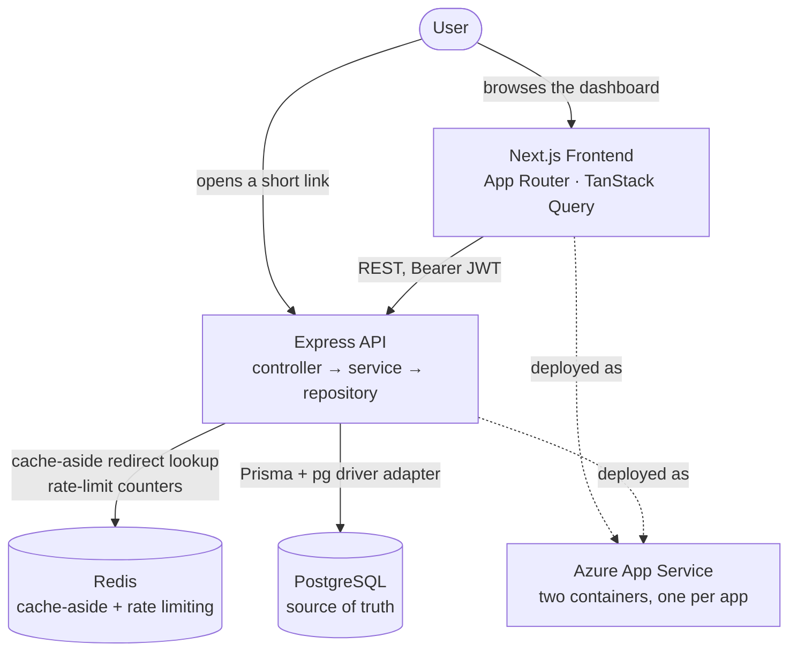

# LinkForge

Most URL shortener tutorials stop at "insert a row, redirect on lookup."
LinkForge starts there and keeps going. It's a fully deployed,
production-shaped service built to explore what a shortener looks like
once real traffic, real failure modes, and real users enter the picture —
authenticated multi-tenant links, a Redis cache designed to survive an
outage instead of causing one, privacy-conscious analytics, and a
deployment pipeline that ships itself from GitHub to Azure with no stored
cloud credentials.

[](https://github.com/nocapgaurav/linkforge/actions/workflows/ci.yml)


---

## Live Demo

- **Frontend** — [linkforge-web.azurewebsites.net](https://linkforge-web.azurewebsites.net)
- **Backend API** — [linkforge-api.azurewebsites.net/api/v1](https://linkforge-api.azurewebsites.net/api/v1)

---

## Highlights

- 🚀 Deployed to Azure App Service through a fully automated GitHub Actions pipeline
- 🔐 OIDC-authenticated CI/CD to GHCR and Azure — zero stored cloud secrets
- ⚡ Redis cache-aside for redirects, fail-open by design
- 🔑 JWT auth with rotating, theft-detected refresh tokens
- 📊 Privacy-conscious analytics — hashed, rotating-salt IPs, no raw PII
- 🐳 Multi-stage, non-root Docker builds with real health checks
- ✅ 250+ automated tests, run against real Postgres and Redis in CI

---

## Features

**Core**
- Custom or generated short links
- Time-based, click-based, and manual expiration
- Password-protected links
- Link editing and soft delete

**Authentication**
- JWT access tokens with rotating refresh tokens
- bcrypt password hashing
- Full account management — profile, password, sessions

**Analytics**
- Per-link click analytics — time series and breakdowns by browser, device, country, referrer
- Privacy-conscious event model, no raw PII stored

**Platform**
- Redis-backed caching and rate limiting, fail-open by design
- Docker, GitHub Actions CI/CD, automated Azure deployment

---

## Developer Experience

- Layered, feature-module backend — one vertical slice per domain
- TypeScript strict mode across both apps
- A versioned REST contract, written before several endpoints existed
- Tests run against real Postgres and Redis, not mocks
- Fully Dockerized local development

---

## Key Engineering Decisions

- **Cache-aside over read-through** — Postgres stays the single source of
  truth; a Redis outage never becomes a correctness problem, only a
  slower one.
- **302, never 301, on redirects** — a cacheable permanent redirect would
  silently break click counting, expiry, and deactivation.
- **Redis fails open** — a down cache or rate limiter degrades to "as if
  Redis didn't exist," never to a blocked request.
- **Refresh tokens rotate on every use** — replaying an already-used token
  revokes the whole session, not just that token.
- **Soft deletes, codes never recycled** — a reissued short code would
  inherit its previous owner's traffic.

---

## Architecture



The frontend never talks to Postgres or Redis directly — every request
goes through the Express API. Redis sits in front of Postgres as a cache
for redirects and a store for rate limiting; if it's unavailable, the
system falls back to Postgres directly rather than failing. Both apps
deploy as independent containers on Azure App Service. Full internals are
in [Documentation](#documentation) below.

---

## Running Locally

### Option A — Docker Compose

```bash
git clone https://github.com/nocapgaurav/linkforge.git
cd linkforge
cp .env.example .env   # set a real JWT_SECRET
docker compose up --build
```

Open http://localhost:3001.

### Option B — Backend and frontend separately

```bash
pnpm install
cp .env.example .env
pnpm db:up
pnpm db:migrate
pnpm dev              # backend on :3000
```

```bash
cd frontend
pnpm install
cp .env.example .env.local
pnpm dev              # frontend on :3001
```

See [`.env.example`](.env.example) and
[`frontend/.env.example`](frontend/.env.example) for the full variable
reference.

---

## Project Structure

```
frontend/   Next.js dashboard
prisma/     Database schema and migrations
src/        Express API
tests/      Unit and integration tests
docs/       Design docs and API specification
.github/    CI and deployment workflows
```

---

## Documentation

- [Architecture Walkthrough](docs/codebase-walkthrough.md)
- [API Specification](docs/api-v1-spec.md)
- [Database Design](docs/url-entity-design.md)
- [Cache Design](docs/redis-cache-design.md)
- [Analytics Design](docs/analytics-design.md)
- [Deployment Guide](docs/azure-deployment.md)

---

## Engineering Challenges

### Prisma client missing in CI, but not locally

- **Problem:** CI failed on a missing-module error for the generated
  Prisma client; the same commands worked locally.
- **Root cause:** The client generates to a gitignored path that persisted
  locally from repeated `prisma migrate dev` runs (which auto-generate
  it). CI's `prisma migrate deploy` does not, and no explicit generate
  step existed.
- **Solution:** Added an explicit `prisma generate` step before build.

### CI-only CORS and browser-redirect failures

- **Problem:** Two integration tests failed only in CI — `204` expected,
  `401` received.
- **Root cause:** `FRONTEND_ORIGIN` existed in the local `.env` but was
  never set in CI's environment — a fresh checkout has no `.env` file at
  all.
- **Solution:** Added `FRONTEND_ORIGIN` to the CI workflow.

### A fire-and-forget write racing test teardown

- **Problem:** An integration test intermittently hit a Postgres
  foreign-key violation during cleanup.
- **Root cause:** Click-event recording is fire-and-forget by design; test
  teardown sometimes ran before the last insert completed.
- **Solution:** Added a short settle delay before teardown deletes fixture
  rows.

### Azure OIDC federated identity mismatch

- **Problem:** Azure login failed with `AADSTS700213`, then `AADSTS70025`.
- **Root cause:** GitHub's actual OIDC subject claim didn't match what the
  federated credential trusted.
- **Solution:** Decoded the real signed token during a workflow run and
  updated the credential to match, rather than guessing at the format.

### Next.js build-time environment variables in a container

- **Problem:** After deployment, registration failed with a `404` missing
  the API's `/api/v1` prefix.
- **Root cause:** `NEXT_PUBLIC_API_URL` is inlined at build time, not read
  at container start — the build used a value missing `/api/v1`.
- **Solution:** Corrected the build-time variable and rebuilt the image.

---

## Future Improvements

- Custom domains for short links
- QR code generation per link
- Background workers / queue-based click ingestion
- Distributed / pre-aggregated analytics at high click volumes
- Multi-region deployment
- CDN in front of the redirect endpoint
- Published load-test benchmarks

---

## License

MIT — see [`LICENSE`](LICENSE).
